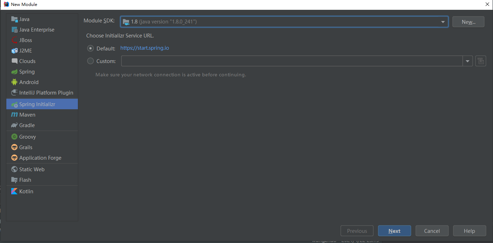
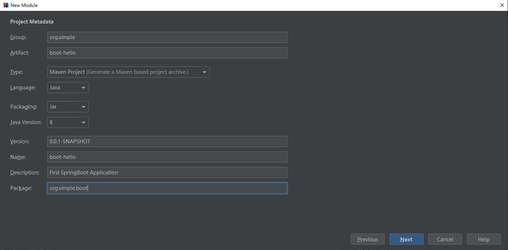
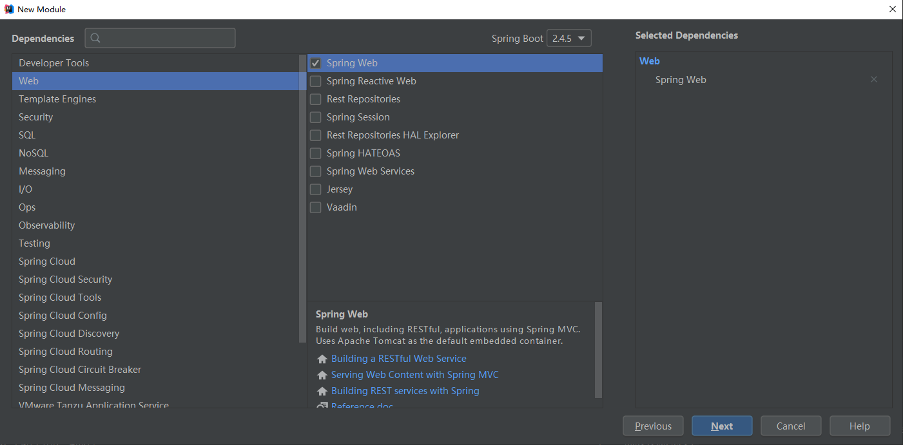
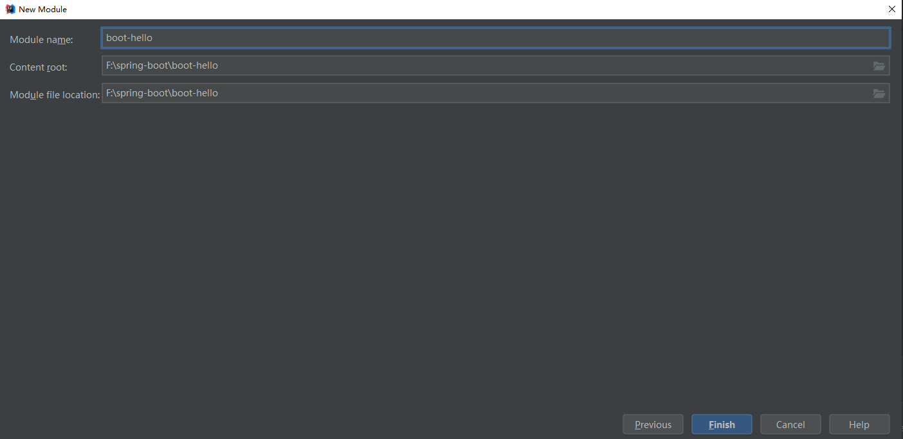
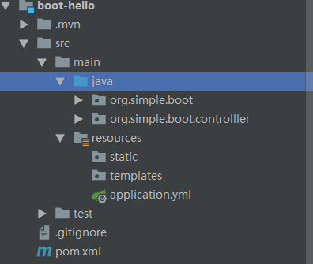

SpringBoot入门程序(SpringBoot2.4.5)

一. 系统环境检查

|  环境   |   版本   |
| :---: | :----: |
| Java  | 1.8及以上 |
| maven |  3.3+  |

Maven配置：

```xml
<mirrors>
	<!-- 使用阿里云镜像配置-->
	<mirror>  
	  	<id>alimaven</id>  
	  	<mirrorOf>central</mirrorOf>     
	  	<name>aliyun maven</name>  
	  	<url>https://maven.aliyun.com/repository/public</url>  
	</mirror>
</mirrors>

<profiles>
	<!-- 使用Java8编译-->
	<profile>
      	<id>jdk-1.8</id>

      	<activation>
			<activeByDefault>true</activeByDefault>
        	<jdk>1.8</jdk>
      	</activation>
		
	  	<properties>
			<maven.compiler.source>1.8</maven.compiler.source>
			<maven.compiler.target>1.8</maven.compiler.target>
			<maven.compiler.compilerVersion>1.8</maven.compiler.compilerVersion>
	  	</properties>
	</profile>
</profiles>

```

二. SpringBoot的Hello World程序

2.1 使用IDEA的Spring Initializer创建一个名为boot-hello的Spring Boot应用程序。

步骤1：使用IDEA的Spring Initializer初始化向导，选择JDK为自己安装的JDK版本。




步骤2：填写项目初始化的相关信息




步骤3：选择需要添加的依赖(这里我们只选择Web模块)



步骤4：完成项目的创建




2.2 项目结构



2.3 编写业务代码

在项目中我们新建一个org.simple.boot.controller包，在新建的包中创建一个HelloController类。

```java
package org.simple.boot.controlller;

import org.springframework.web.bind.annotation.GetMapping;
import org.springframework.web.bind.annotation.RestController;

@RestController
public class HelloController {

    @GetMapping("/hello")
    public String hello(){
        return "Hello SpringBoot!";
    }
}
```

2.4 编写主程序类

在项目的org.simple.boot(项目的父包)包中有一个类，代码如下：

```java
package org.simple.boot;

import org.springframework.boot.SpringApplication;
import org.springframework.boot.autoconfigure.SpringBootApplication;

@SpringBootApplication
public class BootHelloApplication {
    public static void main(String[] args) {
        SpringApplication.run(BootHelloApplication.class, args);
    }
}
```

2.5 编写项目的配置文件

SpringBoot项目的配置信息在resources(类路径下)的application.properties/application.yml中。

```yaml
server:
  port: 8082
```

2.6 启动SpringBoot应用程序

直接启动SpringBoot的主程序类即可启动SpringBoot应用程序。


三. SpringBoot项目解析。

3.1 SpringBoot项目POM文件解析。

在前面我们创建的boot-hello项目的pom文件如下：

```xml
<?xml version="1.0" encoding="UTF-8"?>
<project xmlns="http://maven.apache.org/POM/4.0.0" xmlns:xsi="http://www.w3.org/2001/XMLSchema-instance"
         xsi:schemaLocation="http://maven.apache.org/POM/4.0.0 https://maven.apache.org/xsd/maven-4.0.0.xsd">
    <modelVersion>4.0.0</modelVersion>
    <!-- 父项目-->
    <parent>
        <groupId>org.springframework.boot</groupId>
        <artifactId>spring-boot-starter-parent</artifactId>
        <version>2.4.5</version>
        <relativePath/> <!-- lookup parent from repository -->
    </parent>
  	<!-- 项目本身的一些描述信息-->
    <groupId>org.simple</groupId>
    <artifactId>boot-hello</artifactId>
    <version>0.0.1-SNAPSHOT</version>
    <name>boot-hello</name>
    <description>First SpringBoot Application</description>
    <properties>
        <java.version>1.8</java.version>
    </properties>
  	
  	<!-- 项目的依赖信息-->
    <dependencies>
      	<!-- 开发Web的场景启动器，包含使用SpringBoot开发Web模块的所有依赖-->
        <dependency>
            <groupId>org.springframework.boot</groupId>
            <artifactId>spring-boot-starter-web</artifactId>
        </dependency>

      	<!-- springboot的测试依赖-->
        <dependency>
            <groupId>org.springframework.boot</groupId>
            <artifactId>spring-boot-starter-test</artifactId>
            <scope>test</scope>
        </dependency>
    </dependencies>
	
  	<!-- 项目的构建信息-->
    <build>
      	<!-- 插件信息-->
        <plugins>
          	<!-- springboot的打包插件，可将项目打包为一个可执行的jar包-->
            <plugin>
                <groupId>org.springframework.boot</groupId>
                <artifactId>spring-boot-maven-plugin</artifactId>
            </plugin>
        </plugins>
    </build>
</project>
```

3.2 SpringBoot 的依赖管理。

在入门程序的POM文件中，我们声明了项目的父项目如下：

```xml
<!-- 父项目-->
<parent>
      <groupId>org.springframework.boot</groupId>
       <artifactId>spring-boot-starter-parent</artifactId>
       <version>2.4.5</version>
       <relativePath/> <!-- lookup parent from repository -->
 </parent>
------------------------------------------------------------------------------------------------
<!-- 父项目的父项目-->
<parent>
    <groupId>org.springframework.boot</groupId>
    <artifactId>spring-boot-dependencies</artifactId>
    <version>2.4.5</version>
</parent>
-----------------------------------------------------------------------------------------------
<!-- 
spring-boot-dependencies中声明了许多依赖的版本信息，所以我们只要引入了相关的依赖，可以不用写依赖的版本信息。
spring-boot-dependencies也被称为依赖版本仲裁中心。
-->
<properties>
    <activemq.version>5.16.1</activemq.version>
    <antlr2.version>2.7.7</antlr2.version>
    <appengine-sdk.version>1.9.88</appengine-sdk.version>
    <artemis.version>2.15.0</artemis.version>
    <aspectj.version>1.9.6</aspectj.version>
    <assertj.version>3.18.1</assertj.version>
    <atomikos.version>4.0.6</atomikos.version>
    <awaitility.version>4.0.3</awaitility.version>
  	......
</properties>
```

如果不想使用SpringBoot的默认版本，SpringBoot允许自定义依赖的版本，其方法步骤如下：

1. 在spring-boot-dependencies版本管理中查看引入的依赖的key，如mysql数据库连接的key为

   ```xml
   <mysql.version>8.0.23</mysql.version>
   ```

2. 在当前的项目里面重写配置,并在引入依赖时指定依赖的版本。

   ```xml
   <properties>
     		<!-- 重写依赖版本-->
           <mysql.version>5.1.43</mysql.version>
   </properties>

   <dependencies>
           <!-- 使用SpringBoot依赖管理中指定的版本-->
           <dependency>
               <groupId>org.springframework.boot</groupId>
               <artifactId>spring-boot-starter-web</artifactId>
           </dependency>

           <!-- 自定义依赖版本-->
           <dependency>
               <groupId>mysql</groupId>
               <artifactId>mysql-connector-java</artifactId>
               <version>${mysql.version}</version>
           </dependency>
   </dependencies>
   ```

3. 引入的依赖不在SpringBoot的版本仲裁中进行管理的依赖需要在引入是明确指定依赖版本。

3.3 SpringBoot中的场景启动器

在前面的pom文件中，我们引入了这样的一个依赖

```xml
<dependency>
            <groupId>org.springframework.boot</groupId>
            <artifactId>spring-boot-starter-web</artifactId>
 </dependency>
```

这个依赖为使用SpringBoot开发Web项目的场景启动器。

所谓场景启动器就是我们需要开发某一个场景的一系列依赖的集合。比如我们需要进行Web开发，则Web开发有关的依赖如json，SpringMVC、tomcat等依赖都会被依赖，而SpringBoot的spring-boot-starter-web就是对Web开发场景的一次封装，它将开发Web有关的依赖进行了整合，所以我们只需要引入这个场景启动器就能使用SpringBoot进行Web开发。


SpringBoot官方的场景启动器命名方式为：spring-boot-starter-\*，其中的*即为某个具体的场景启动器。

SpringBoot官方提供的场景启动器列表：[SpringBoot官方场景启动器](https://docs.spring.io/spring-boot/docs/current/reference/html/using-spring-boot.html#using-boot-starter)

第三方简化SpringBoot开发的场景启动器命名方式: *-spring-boot-starter。如整合mybatis的第三方场景启动器为mybatis-spring-boot-starter。

SpringBoot场景启动器的底层依赖：

```xml
<!-- SpringBoot自动配置的核心依赖-->
<dependency>
      <groupId>org.springframework.boot</groupId>
      <artifactId>spring-boot-starter</artifactId>
      <version>2.4.5</version>
      <scope>compile</scope>
</dependency>
```

3.4 初识SpringBoot的自动配置

